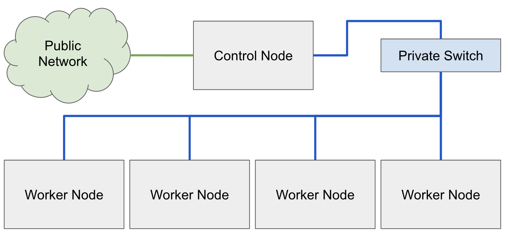

# Warewulf Cluster Architecture

## System Architecture
Warewulf's primary design goal is to facilitate the typical architecture of an HPC style cluster. The roots of these 
clusters originates from the foundational architecture that has influenced these architectures for the last 20-30 
years, commonly known as the "Beowulf".

### The Beowulf
The original [Beowulf Cluster](https://en.wikipedia.org/wiki/Beowulf_cluster) was developed in 1996 by Dr. Thomas 
Sterling and Dr. Donald Becker at Nasa. The architecture is defined as a group of similar compute worker nodes all 
connected together using standard commodity equipment on a private network segment. The control node is dual homed 
(has two network interface cards) with one of these network interface cards attached to the upstream network and the 
other connected to the same private network which connects the compute worker nodes (as seen in the figure below).

This architecture is very advantageous for creating a scalable resource for HPC clustering but it is also only a 
very simple portrayal of the base foundation. To this we must add storage, scheduling and resource management, 
monitoring, interactive systems, and as the system grows, it maybe needed to have groups of nodes, that have 
different features, architectures, vintages, memory configuration, GPUs, or interconnects. As the system grows, 
the necessity for a scalable control surface also increases which can result in even more complexity.

### Provisioning
Warewulf is designed to support not only the simplest of clusters, but also the most complicated, largest, and 
specialized resources that are demanded today. But in all of these configurations, we go back to this standard 
architecture illustrated above. This is because Warewulf is designed to "own" the network broadcast domain due to 
how these worker nodes boot.

As mentioned before, Warewulf is designed first and foremost to be a stateless provisioning subsystem. This means 
that the worker nodes maintain no state about their configuration, operating system, or other when they are powered 
off. The result of this is when these systems boot, they retain no knowledge on who they are, what they are supposed 
to do, or how they got there. For these reasons, these systems will need to boot via
[PXE](https://en.wikipedia.org/wiki/Preboot_Execution_Environment).

#### PXE
By Default, most servers will have network interface cards that support PXE. In a nutshell, PXE will allow the 
network card to be seen by the BIOS as a bootable device. This means that the boot order may need to be configured 
in the system's BIOS on the worker nodes to allow it to boot. If there is also another bootable device on these 
systems, it might be necessary to set the network interface card to boot first.

When the system boots via PXE, it will begin a chain reaction of events:

1. The network card will register an option rom into the BIOS
1. The BIOS will run through all of its functions and finishes with boot devices
1. The boot devices are attempted to be booted in the defined order
1. When it gets to the network boot device, PXE is run from the firmware on the network card
1. PXE will request a Bootp/DHCP on the network
1. If the DHCP response includes a boot file name, it will download this file (iPXE boot image) over TFTP
1. Once iPXE is downloaded, it is loaded by the network card and it will request a configuration from the 
   server
1. The configuration will tell iPXE what to download and load

Warewulf manages the entire process once the worker node's network device has begun the PXE process.

#### Warewulf Server
Warewulf will configure and setup the controller's DHCP and TFTP services, as well as putting all the required 
files into place but once the iPXE file has been sent and loaded on the nodes, all network communication from this 
point on is being handled by the Warewulf server over HTTP. The order of events from this point on are as follows:

1. iPXE requests it's configuration and Warewulf generates this on demand from the configured template
1. The default iPXE template tells iPXE to request a kernel, VNFS image, runtime kernel modules, and a system overlay
1. Each of the requested files will be "served" to the node

#### Post PXE
Once the worker node has received all the required files, the kernel will be booted and the runtime components will be
loaded into the kernel's initial ram file system (initramfs). The order of this is very because each layer is
"layered" on top of the previous. The layers are implemented in the following order:

1. VNFS/Container image
1. Kernel modules
1. System Overlay
1. Runtime Overlay (repeated at a given interval)

As part of the provisioning process, the system boots after the System Overlay has been provisioned which means that 
the Runtime Overlay occurs after `/sbin/init` has been called and the system. This delineation is important because 
it clearly defines what should be in the system Vs. runtime overlay. More on overlays in the next section.

Before calling `/sbin/init` (or `init` to override in the node configuration file), Warewulf must set up the system. 
Again, this process occurs after the System Overlay has been provisioned. This is where the system initializes and 
prepares for booting the runtime OS. Depending on the configuration, the system might boot directly in the initramfs 
file system as it stands, or it could migrate the root file system to a different mount point (e.g. `tmpfs` or at 
some point, hard drives).

Other things that get done at this stage are setting up and enabling SELinux, IPMI, making any needed changes or 
configurations to the file system before booting it, and starting up the `wwclient` which is responsible for loading 
the runtime overlay.

Lastly, the `init` process is executed with PID 1 and thus "boots" the VNFS container. This is where SysVInit, 
Upstart, or Systemd takes over.

#### Warewulf Overlays
As described above, Warewulf uses layers to provision. The first layer is static across any number of nodes, but 
each node may require some custom configurations, for example, network. This means there must be a method for 
leveraging a base file system which can be shared by many nodes and also be able to configure these file systems 
with custom per-node options at a large scale.

Typically, there are two major times this configuration needs to be done. Pre "boot" and post "boot". In this case, as
described above, we can consider the call to `/sbin/init` the delineation point and the proper way to consider the two
user configurable overlays: system and runtime.

**System Overlay**: The system overlay is what will be present before `/sbin/init` is called. This gives the 
administrator the ability to control the configuration of the booting system itself. For example, network 
configuration is necessary to be configured on every node, but each node must have a different network configuration 
otherwise the IP addresses will clash and this must be set before Systemd brings up the network device. The Warewulf 
system overlay is the right place to configure this.

**Runtime Overlays**: Some configurations happen after the system boots and continuously at periodic intervals. For 
example user and group accounts. You probably don't want to reprovision a node to add a user or change a runtime 
configuration, and this is where you will need to use the runtime overlay.

Both overlays leverage a similar file system template structure. Each overlay (you can create any number of them) 
can include text files, directories, links, and templates. Templates allow you to customize any of the content 
within an overlay dynamically for each node that will be leveraging that template.

